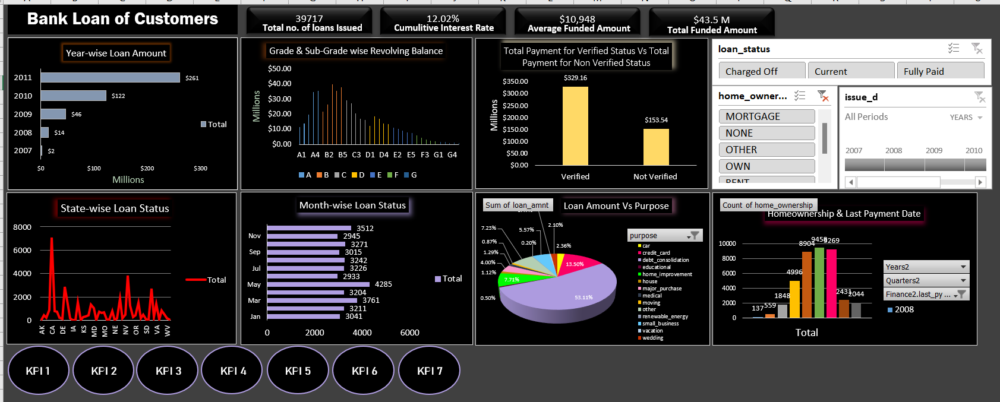
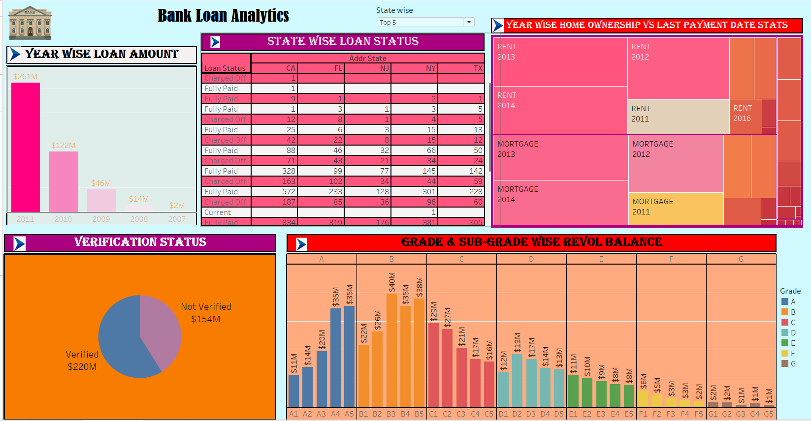

# Bank-Analytics

*PROJECT OVERVIEW*

•	Developed Data-Driven Dashboards: Created comprehensive dashboards in Excel, Power BI and Tableau to track key healthcare metrics, including total discharges, patient days, and net patient revenue over a five-year period, aiding in operational efficiency and financial analysis.

•	Data Cleaning and Transformation: Led the data cleaning and transformation process by splitting and merging complex datasets using Excel and Power Query to ensure accurate import into SQL databases for analysis.

•	Revenue Trend Analysis: Conducted trend analysis on hospital revenues, identifying financial patterns and providing insights into operational improvements and growth opportunities.

•	Identified Key Improvement Areas and Provided Recommendations for enhancing revenue streams and operational efficiencies, addressing challenges in data accuracy and reporting.

•	SQL Query Development: Designed and executed MySQL queries for each KPI, retrieving and analyzing critical data, enhancing decision-making on healthcare operations and financial performance

•	Overcame Data Integration Challenges: Successfully addressed challenges in importing and processing large datasets, including resolving errors during SQL data import by leveraging Power Query for smooth integration

*EXCEL DASHBOARD*

*POWERBI DASHBOARD*

asset/PowerBi_Dashbord.png

*Tableau DASHBOARD 1*

